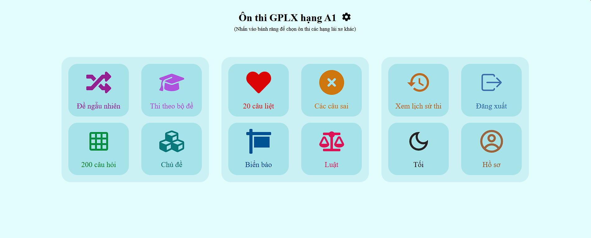
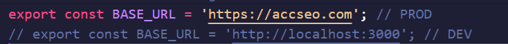

# Website hỗ trợ luyện thi bằng lái xe

Website Luyện Thi GPLX cung cấp một nền tảng học và luyện thi giấy phép lái xe trực tuyến. Giao diện thân thiện giúp người dùng dễ dàng truy cập các đề thi thử, câu hỏi lý thuyết và mẹo ôn tập hiệu quả. Trang web hỗ trợ các hạng bằng như A1, A2, B1, B2 và C, phù hợp cho người mới bắt đầu hoặc muốn ôn luyện kỹ năng. Đây là trang web hữu ích giúp bạn chuẩn bị tốt cho kỳ thi sát hạch lái xe.



Truy cập ngay tại: [https://luyenthigplx.netlify.app/](https://luyenthigplx.netlify.app/)

## Tính năng chính

- **Làm bài thi trực tuyến** : Dễ dàng thao tác chỉ với một cú nhấp chuột.
- **Đăng ký & Đăng nhập** : Trở thành thành viên để truy cập nhiều tính năng cao cấp.
- **Đăng nhập** : Đăng nhập để sử dụng các tính năng của thành viên.
- **Lịch sử thi** : Theo dõi chi tiết kết quả các lần thi.
- **Thiết kế đáp ứng** : Tương thích với mọi thiết bị, tiện lợi cho học tập mọi nơi.

## Công nghệ sử dụng

### Backend

- Node.js, Express.js
- MySQL (mysql2)
- jsonwebtoken, bcryptjs
- multer, nodemailer

### Frontend

- React.js, Redux Toolkit
- React Router DOM, React Toastify
- SASS/SCSS, Recharts
- NProgress

### Khác

- Vite: Build tool.
- Netlify: Triển khai frontend.
- VPS: Triển khai backend.

## Hướng dẫn cài đặt

### Yêu Cầu

Biết cơ bản về MySQL, npm và vite.

Để chạy dự án cục bộ, hãy làm theo các bước sau:

1. **Tạo database trong MySQL**

```
CREATE DATABASE GPLX;
```

2. **Khởi tạo data**

    Chạy file initialData.sql từ thư mục db/initialData**

4. **Sao chép kho lưu trữ**

```
git clone https://github.com/hieuhocit/2425_CS445U_nhom01.git
```

4. **Điều hướng đến thư mục dự án**

```
cd 2425_CS445U_nhom01
```

3. **Điều hướng đến thư mục backend và cài đặt các gói phụ thuộc**

```
cd backend
npm install
```

4. **Điều hướng đến thư mục frontend và cài đặt các gói phụ thuộc**

```
cd frontend
npm install
```

6. **Cấu hình lại đường dẫn url trong phần frontend để phát triển cục bộ**

    Mở/đóng comment phù hợp cho Development hoặc Production (nằm trong thư mục src/config/baseUrl.ts)
    


8. **Cấu hình file .env trong phần backend theo hướng dẫn dưới đây**

```
DB_HOST=127.0.0.1
DB_USER=Tài khoản database
DB_PASSWORD=Mật khẩu database
DB_NAME=Tên database

ACCESS_TOKEN_SECRET=ACCESS_TOKEN_SECRET_EXAMPLE
REFRESH_TOKEN_SECRET=REFRESH_TOKEN_SECRET_EXAMPLE

ORIGIN_URL=http://localhost:5173 // Đường dẫn gốc của frontend (nơi gọi API)

EMAIL_USER=Tài khoản gmail (sử dụng để gửi mail)
EMAIL_PASS=Mật khẩu app gmail (lên mạng tìm kiếm cách tạo mật khẩu app gmail)

COOKIE_SECRET=COOKIE_SECRET_EXAMPLE
```

8. **Chạy máy chủ (thư mục backend)**

```
npm run start
```

9. **Chạy giao diện (thư mục frontend)**

```
npm run dev
```
